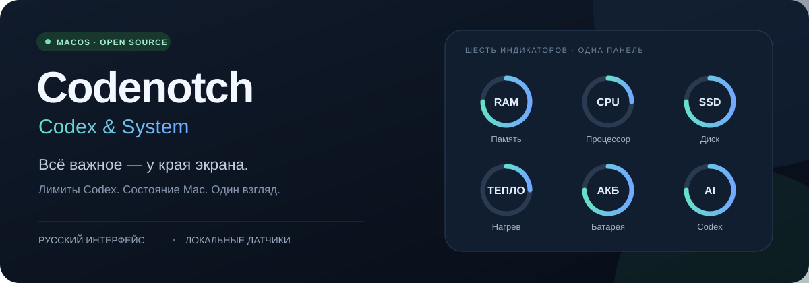

<p align="center">
  
</p>

<p align="center">
  
  
  
  <a href="LICENSE"></a>
</p>

<p align="center"><b>Меньше открытых окон. Больше полезного контекста.</b><br>
Наведите курсор на край экрана — проверьте лимиты Codex, нагрузку и заряд.</p>

<p align="center">
  <a href="#возможности">Возможности</a> ·
  <a href="#быстрый-старт">Быстрый старт</a> ·
  <a href="#приватность-и-ограничения">Приватность</a> ·
  <a href="https://github.com/rpopov041990-design/codenotch-codex-system/issues">Обратная связь</a>
</p>

> **Статус: исходники доступны.** Готовый установочный релиз пока не опубликован. Это неофициальная модификация [vinzdg/codenotch](https://github.com/vinzdg/codenotch) на базе v1.8.0, а не продукт OpenAI или официальный релиз Codenotch. Обложка — схема возможностей, не скриншот приложения.

## Возможности

### Windows — тестовый порт

Добавлена отдельная [Windows-версия TEST](windows/README.md): круговые RAM/CPU/диск/АКБ, раскрытие панели и локальный снимок лимитов Codex. Сборка и артефакт — workflow **Windows preview** во вкладке Actions. Температура, износ батареи и полная история Codex пока не перенесены. Ручная проверка на Windows-ПК нужна; таблица ниже описывает исходную версию **macOS**.

| Индикатор | На панели | В подробностях |
| :--- | :--- | :--- |
| **Codex** | Круговой индикатор лимита | Доступная статистика токенов и срок сброса |
| **Память** | Занятость RAM | Занято / всего, с учётом сжатой памяти |
| **Процессор** | Загрузка CPU | Суммарная активность ядер между замерами |
| **Диск** | Процент заполнения | Занято, свободно и общий объём тома |
| **Нагрев** | Тепловое состояние | Состояние macOS — без выдуманных градусов |
| **Батарея** | Заряд и значок зарядки | Источник питания, состояние и доступные данные об износе |

**Появляется при наведении.** Круглые индикаторы, плавное раскрытие и оформление исходного Codenotch сохранены.

**Настраивается под вас.** Системные показатели можно отключать по отдельности. Они обновляются раз в 3 секунды, пока панель раскрыта.

**Говорит по-русски.** Основные настройки, карточка Codex, числа и единицы времени переведены. Исторические материалы исходного проекта переведены не полностью.

## Откуда появилась эта версия

Идея началась с небольшой панели лимитов Codex. Затем мы перевели интерфейс, добавили локальные системные показатели и батарею, сохранив исходную визуальную механику. Системные индикаторы отделены от аккаунтов: нажатие на них не обновляет и не переключает профиль Codex.

## Приватность и ограничения

**Датчики — локально. Лимиты — через Codex.** Файлы авторизации не входят в репозиторий.

<details>
<summary><b>Какие данные читаются и что важно знать</b></summary>

Системные показатели читаются локально через Mach, Foundation и IOKit. Новые системные датчики не отправляют телеметрию и не сохраняют историю измерений. Для лимитов приложение использует существующую авторизацию Codex и обращается к сервису OpenAI; это не полностью офлайн-приложение. Не передавайте файлы авторизации другим людям и не добавляйте их в Git.

В запуске этой версии подключается только основной профиль Codex. Автоматическое подключение других провайдеров, их фоновые мониторы и автоматический обновлятор отключены. Часть исходных реализаций других провайдеров остаётся в коде; это не сетевой sandbox и не гарантия, основанная на полном анализе трафика.

Память: оценка занятой RAM без файлового кэша, включая сжатые страницы. Диск: занятость тома домашней папки; Finder может иначе учитывать очищаемое место. CPU: доля активности всех ядер между двумя замерами. Недоступные данные показываются как «—» или «Нет данных», а не как ноль. На Mac без внутренней батареи кружок АКБ не показывается. Поля износа зависят от модели Mac и версии macOS.

</details>

## Быстрый старт

Нужны **macOS 15+**, **Xcode** и **XcodeGen**. Проверенная среда: Apple Silicon, Xcode 26.6, XcodeGen 2.46.0. Точная конфигурация — в [`project.yml`](project.yml).

**1. Получите исходники**

```sh
git clone https://github.com/rpopov041990-design/codenotch-codex-system.git
cd codenotch-codex-system
```

**2. Соберите приложение**

```sh
xcodegen generate
xcodebuild -project Codenotch.xcodeproj -scheme Codenotch \
  -configuration Debug -destination 'platform=macOS,arch=arm64' \
  -derivedDataPath build/local \
  CONFIGURATION_BUILD_DIR="$HOME/.local/share/codenotch-system/Debug" \
  CODE_SIGN_IDENTITY=- DEVELOPMENT_TEAM= CODE_SIGN_STYLE=Automatic build
```

**3. Откройте собранное приложение**

Файл: `~/.local/share/codenotch-system/Debug/Codenotch.app`. Для показателей Codex нужна существующая авторизация Codex; системные датчики отдельного аккаунта не требуют.

> Сборка имеет локальную **ad-hoc-подпись**, а не Developer ID или нотарификацию Apple. Не отключайте защиту macOS ради запуска. Выходной каталог вне iCloud уменьшает риск ошибок подписи из-за файловых метаданных.

## Проверки

```sh
python3 Scripts/check_codex_only.py
```

Для XCTest замените последнее `build` в команде выше на `test`. Добавлены проверки русского перевода и ширины строк, локальных системных показателей, отсутствующих данных и индикатора батареи. Статические проверки не заменяют проверку интерфейса и поведения приложения на конкретном Mac.

## Лицензия и благодарности

MIT; исходное авторство Vinz сохранено в `LICENSE`. Благодарность авторам Codenotch и сторонних компонентов. Их лицензии находятся рядом с соответствующими ресурсами и исходниками. Оригинальные материалы проекта не следует воспринимать как описание функций, включённых в этой модификации.

---

<p align="center">Есть идея или нашли ошибку? <a href="https://github.com/rpopov041990-design/codenotch-codex-system/issues">Расскажите в Issues</a>.<br>
<sub>Не прикладывайте токены, файлы авторизации и скриншоты с личными данными.</sub></p>
